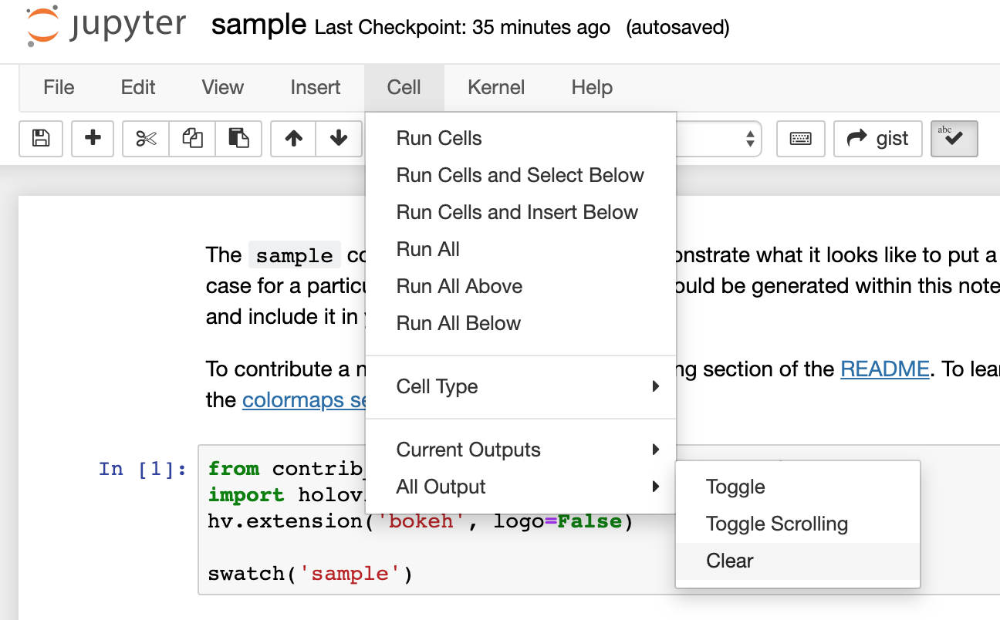

# contrib_colormaps: User-contributed colormaps

|    |    |
| --- | --- |
| Build Status | [](https://travis-ci.org/pyviz/contrib_colormaps) [](https://ci.appveyor.com/project/pyviz/contrib_colormaps/branch/master) |
| Latest dev release | [](https://github.com/pyviz/contrib_colormaps/tags) |
| Latest release | [](https://github.com/pyviz/contrib_colormaps/releases) [](https://pypi.python.org/pypi/contrib_colormaps) [](https://anaconda.org/pyviz/contrib_colormaps) [](https://anaconda.org/conda-forge/contrib_colormaps) [](https://anaconda.org/anaconda/contrib_colormaps) |
| Docs | [](https://github.com/pyviz/contrib_colormaps/tree/gh-pages) [](http://contrib_colormaps.pyviz.org) |


## What is it?

contrib_colormaps is a collection of user-contributed colormaps
for use with Python plotting programs such as
[Bokeh](https://bokeh.org),
[Matplotlib](https://matplotlib.org),
[HoloViews](https://holoviews.org), and
[Datashader](https://datashader.org).


## Installation

contrib_colormaps supports Python 2.7, 3.5, 3.6 and 3.7 on Linux, Windows,
or Mac and can be installed with conda from the pyviz channel:

```
conda install -c pyviz contrib_colormaps
```

or with pip:

```
pip install contrib_colormaps
```

## Contributing

To add a colormap, open a pull request on this repository adding the following files:

1. comma-separated file of RGB values to the contrib_colormaps/colormaps
   directory. This file should look like:

   ```
   0, 0.20755, 0.97632
   0, 0.22113, 0.96201
   ```

2. A Jupyter notebook in [examples/colormaps](examples/colormaps) meeting the following criteria:

    1. a name that matches the name of the csv
            e.g. for a new colormap called `rainforest` with a csv *rainforest.csv* there should be a corresponding *rainforest.ipynb*
    2. an explanation of the colormap - what is it? and when/why would someone use it?
    3. a swatch of the colormap - we recommend using our [swatch function](index.ipynb), but it's not required
    4. at least one example plot using the colormap - it can be exclusively Bokeh, Matplotlib, or Holoviews

   The notebook should be cleared of all outputs. To use the UI, click Cell -> All Outputs -> Clear

   

   OR clear them automatically on commit using the predefined git hook.
   From within the cloned repository, run:

   ```bash
   git config core.hooksPath .githooks
   ```

3. A pytest-mpl baseline image for tests. To create this image first install pytest-mpl:

    ```bash
    pip install pytest-mpl
    ```

    Then generate the figure **from within the tests directory** run:

    ```bash
    pytest --mpl-generate-path=baseline
    ```

    See [examples/colormaps](contrib_colormaps/tests) for more details.


### Sample Pull Request
You can use this sample pull request as a model: [#3](https://github.com/pyviz/contrib_colormaps/pull/3)

## About PyViz
contrib_colormaps is part of the PyViz initiative for making Python-based
visualization tools work well together. See [pyviz.org](http://pyviz.org).
